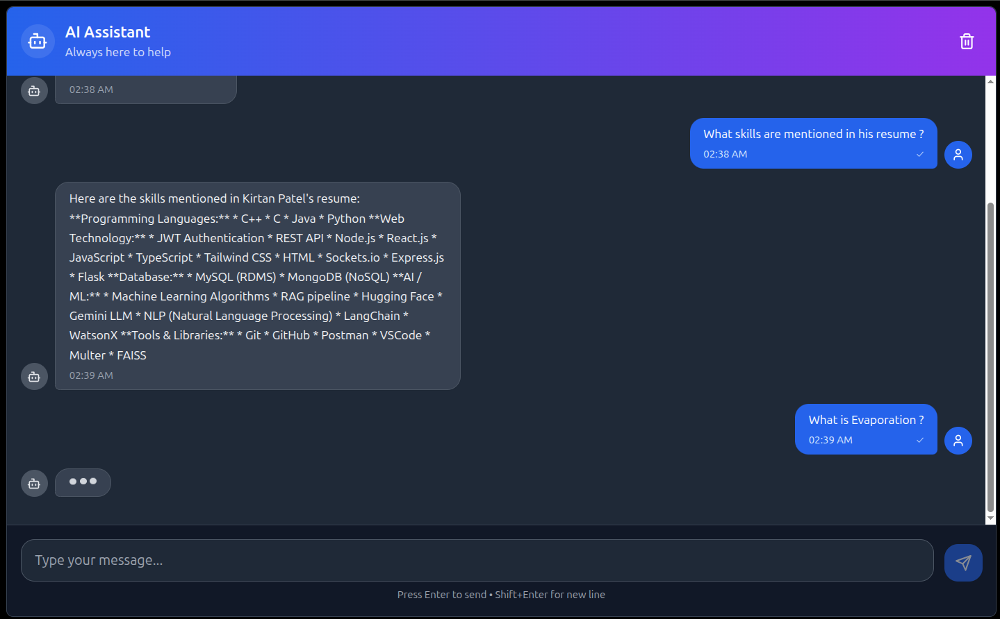
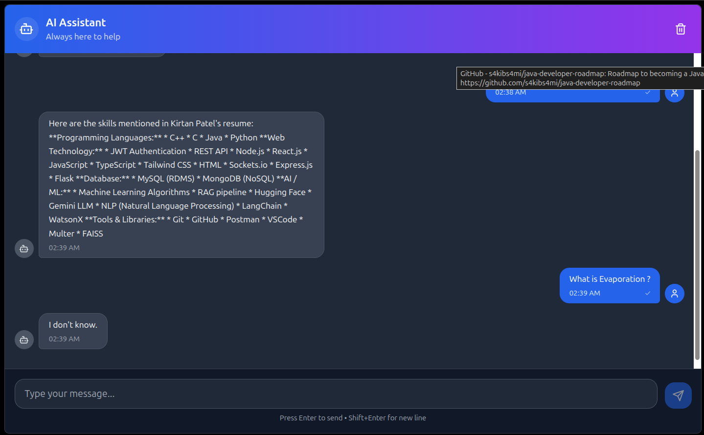

## Problem Solved
The most challenging problem I solved recently was building a robust RAG pipeline for my "Chat with PDF" application. The most significant challenge involved was how to ensure that the LLM provided accurate, document-grounded responses, instead of hallucinating, when the information was dense or ambiguous in the PDF. I iterated through various chunking strategies, tested multiple Hugging Face embedding models, and fine-tuned the threshold of FAISS similarities to ensure consistent retrieval of high-quality context. Furthermore, I developed a mechanism for detecting low-confidence or out-of-scope questions to enable the system to decline gracefully instead of returning incorrect answers. Another major challenge was optimizing the PDF ingestion pipeline to avoid memory spikes or timeouts while processing large documents. After multiple rounds of testing and profiling, the final pipeline demonstrated reliable retrieval performance with significantly reduced hallucinations.

## Study Notes Generator

An AI-powered application that transforms PDF documents into comprehensive study materials including summaries, key notes, and interactive flashcards.

## Features

- **PDF Upload**: Drag-and-drop interface for easy PDF uploads
- **AI-Powered Processing**: Uses RAG (Retrieval Augmented Generation) with LangChain
- **Smart Summaries**: Comprehensive summaries highlighting key concepts
- **Key Notes**: Extracted important points in organized format
- **Interactive Flashcards**: Q&A flashcards with flip animation
- **Export Options**: Download summaries, notes, and flashcards
- **Dark Theme**: Modern, eye-friendly dark interface
- **Responsive Design**: Works perfectly on all devices

## Tech Stack

### Frontend
- **React 18** with TypeScript
- **Tailwind CSS** for styling
- **Lucide React** for icons
- **Vite** for development and building

### Backend
- **Python Flask** web framework
- **LangChain** for RAG implementation
- **FAISS** for vector storage
- **HuggingFace Embeddings** (free)
- **TogetherAI API** for cost-effective LLM access
- **PyPDF2** for PDF processing

## Quick Start

### Frontend Setup

1. Install dependencies:
```bash
npm install
```

2. Start the development server:
```bash
npm run dev
```

The frontend will be available at `http://localhost:5173`

### Backend Setup

1. Navigate to the backend directory:
```bash
cd backend
```

2. Install Python dependencies:
```bash
pip install -r requirements.txt
```

3. Set up environment variables:
```bash
cp .env.example .env
# Edit .env and add your TOGETHER_API_KEY
```

4. Start the Flask server:
```bash
python app.py
```

The backend will be available at `http://localhost:5000`

## Getting TogetherAI API Key

1. Visit [https://api.together.xyz/](https://api.together.xyz/)
2. Sign up for a free account
3. Get your API key from the dashboard
4. Add it to your `.env` file in the backend directory

## Usage

1. Open the application in your browser
2. Upload a PDF document using the drag-and-drop interface
3. Wait for AI processing to complete
4. Review the generated study materials:
   - **Summary**: Comprehensive overview of the document
   - **Notes**: Key points and important concepts
   - **Flashcards**: Interactive Q&A cards for active learning
5. Export materials for offline study

## AI Pipeline

The application uses a sophisticated RAG (Retrieval Augmented Generation) pipeline:

1. **PDF Processing**: Extract and clean text from uploaded PDFs
2. **Text Chunking**: Split documents into manageable segments
3. **Embeddings**: Convert text to vectors using HuggingFace models
4. **Vector Store**: Create searchable index with FAISS
5. **Retrieval**: Find relevant chunks for each query
6. **Generation**: Use TogetherAI's LLaMA model for content creation

## Cost Optimization

- Uses free HuggingFace embedding models
- Leverages TogetherAI's competitive LLM pricing
- Implements efficient text chunking
- Optimizes token usage for cost-effective processing

## Development

### Frontend Development
```bash
npm run dev      # Start development server
npm run build    # Build for production
npm run lint     # Run ESLint
```

### Backend Development
- Set `FLASK_DEBUG=True` in `.env` for development mode
- Use `python app.py` to start with hot reloading
- Check logs for debugging information

## Screenshots






## Contributing

1. Fork the repository
2. Create a feature branch
3. Make your changes
4. Test thoroughly
5. Submit a pull request


## Support

For issues and questions:
1. Check the existing issues
2. Create a new issue with detailed information
3. Include error logs and steps to reproduce

---

Built with ❤️ for students and educators worldwide.
